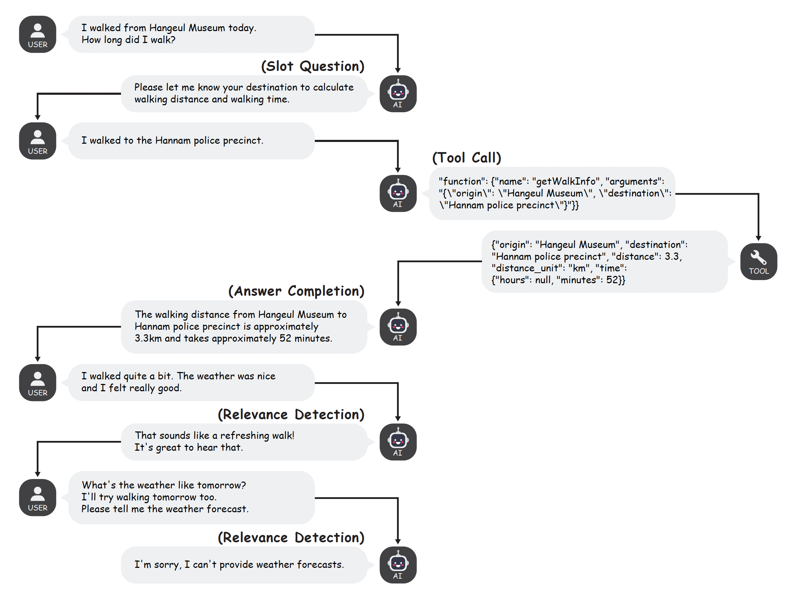

# FunctionChat-Bench: 한국어 Tool-use 대화에서 언어 모델의 생성 능력 종합 평가

## 소개

FunctionChat-Bench는 대화 환경에서 LLM의 Tool-Use(Function Calling) 능력을 평가하기 위해 설계된 벤치마크 데이터셋입니다. 이 데이터셋은 한국어 대화 데이터를 기반으로 구축되었으며 싱글턴(single-turn), 멀티턴(multi-turn) 상황에 필요한 다양한 기능을 정밀하게 평가하는 데 초점을 맞춰 설계되었습니다.




## 데이터셋 구성

FunctionChat-Bench는 다음과 같은 데이터셋으로 구성되어 있습니다:

- **SingleCall**
    - LLM이 여러 함수들 중 얼마나 정확하게 필요한 함수를 호출할 수 있는지를 평가합니다.
    - 서로 다른 **25개의 함수를 선택하는 싱글턴 프롬프트가 함수별로 4개씩 존재**합니다.
        - 예를 들어, 'informDday'라는 함수가 있다면, 이 함수와 관련된 4가지 대화 프롬프트:
            ```
            "오늘이 결혼한지 며칠째야?"
            "크리스마스까지 얼마나 남았나요?"
            "1차 심사일이 언제인가요?"
            "디데이목록에서 원고마감일 찾아줘"
            ```
    - **5개의 tools type은 다음과 같이 정의됩니다:**
        - **1_exact**: Assistant에게 후보 functions를 선택되어야 할 함수 1개만 제공
        - **4_random**: 선택되어야 할 함수 1개와 랜덤으로 선별한 함수 3개를 제공
        - **4_close**: 선택되어야 할 함수 1개와 유사한 도메인의 함수 3개를 제공
        - **8_random**: 선택되어야 할 함수 1개와 랜덤으로 선별한 함수 7개를 제공
        - **8_close**: 선택되어야 할 함수 1개와 유사한 도메인의 함수 7개를 제공
    - 25개 함수를 기준으로 구축된 싱글턴 프롬프트들과 tools type을 조합하여 **500개의 단일 대화턴**으로 구성됩니다.

- **Dialog**
    - 다양한 대화 시나리오 **45개**를 포함하고 있습니다.
    - 각 시나리오는 실제 사용자와 LLM 간의 멀티턴(multi-turn) interaction을 반영합니다.
    - 상황 4가지(call, completion, slot, relevance)를 정의하고, 각 상황에서 적절한 응답을 얼마나 정확하게 했는지 평가합니다.

        | 카테고리 | 턴 수 | 설명 |
        |----------|------:|------|
        | **call** | 70 | 함수 선택 및 파라미터 추출의 정확도 |
        | **completion** | 71 | 함수 실행 결과 기반 응답 생성의 품질 |
        | **slot** | 36 | 누락된 필수 파라미터 식별 및 질의 능력 |
        | **relevance** | 23 | 적합한 함수가 없을 때 응답의 적절성 |

        - **call**: LLM은 user prompt에 응답을 위한 함수를 선택하고 필요한 매개변수를 정확하게 추출해야 합니다.
            ```
            context:
             user: 제리 출국날이 언제였지?

            assistant: tool_calls
                       {"function": {"name": "informDday", "arguments": "{\"searchTerm\": \"제리 출국날\"}"}}
            ```

        - **completion**: LLM은 tool의 결과를 보고 적절한 응답을 생성해야 합니다.
            ```
            context:
             user: 제리 출국날이 언제였지?
             assistant: tool_calls ...
             tool: {"ddayName": "제리 출국날", "ddayDate": "2024-04-23", "daysRemaining": 48}

            assistant: 제리 출국날은 2024년 4월 23일입니다. 앞으로 48일 남았습니다.
            ```

        - **slot**: LLM은 function call을 하기 위한 필요 매개변수를 사용자로부터 질의해야 합니다.
            ```
            context:
             user: 송별회 일정 잡기 to do list에 추가해줘.

            assistant: 알겠습니다. 데드라인이 언제인가요?
            ```

        - **relevance**: LLM은 user prompt에 기능을 제공할 수 없을 때 적절한 응답을 생성해야 합니다.
            ```
            context:
             user: 다빈이한테 괜찮을 때 전화 한번 달라고 문자 남겨줘.

            assistant: 문자 전송 기능은 없습니다.
            ```

- **CallDecision**
    - user의 의도와 target function이 동일할 때, input 조건의 차이에 따라 올바른 응답 유형을 선택하는 능력을 평가합니다.
    - **606개**의 테스트 케이스를 포함합니다.

        | 카테고리 | 수량 | 설명 |
        |----------|-----:|------|
        | **CALL** | 100 | 필수 파라미터가 모두 존재할 때 함수 호출의 정확도 |
        | **REJECT** | 100 | 적합한 함수가 없을 때 거절 응답의 적절성 |
        | **SLOT-all** | 100 | 필수 파라미터 전체 누락 시 전부 질의하는 능력 |
        | **SLOT-some** | 306 | 일부 파라미터만 누락 시 부족한 것만 식별하여 질의하는 능력 |

- **Parallel**
    - 처리 순서를 지키지 않아도 되는 2건 이상의 함수 호출이 동시에 일어나는 시나리오에서 **함수 호출 메시지 생성의 정확성**과 **최종 답변 전달 능력**을 평가합니다.
    - 사용자가 독립적인 여러 작업을 한 번에 요청할 때, 모델은 필요한 모든 함수를 단일 턴에서 함께 호출해야 합니다.
    - **100개**의 테스트 케이스를 포함합니다.

        | 카테고리 | 수량 | 설명 |
        |----------|-----:|------|
        | **CALL-same2** | 20 | **같은** 함수의 **2회** 동시 호출 정확도 |
        | **CALL-same3** | 10 | **같은** 함수의 **3회** 동시 호출 정확도 |
        | **CALL-diff2** | 40 | **서로 다른** 함수 **2개**의 동시 호출 정확도 |
        | **COMPLETION-same2** | 10 | **같은** 함수 **2회** 병렬 호출 결과 기반 응답 품질 |
        | **COMPLETION-same3** | 5 | **같은** 함수 **3회** 병렬 호출 결과 기반 응답 품질 |
        | **COMPLETION-diff2** | 15 | **서로 다른** 함수 **2개** 병렬 호출 결과 기반 응답 품질 |

    - 예시:
        ```
        user: 지금 가장 가까운 ATM 찾아줘. 그리고 토비의 식사 알림을 오후 6시로 설정해줘.

        assistant: tool_calls
                   [{"function": {"name": "find_nearest_atm", "arguments": "{}"}},
                    {"function": {"name": "schedule_pet_meals", "arguments": "{\"pet_name\": \"토비\", \"feeding_time\": \"18:00\"}"}}]
        ```

- **Sequential**
    - 처리 순서를 지켜야 하는 2건 이상의 함수 호출이 순차적으로 일어나는 시나리오에서 **함수 호출 메시지 생성의 정확성**과 **최종 답변 전달 능력**을 평가합니다.
    - 이전 함수 호출의 출력이 다음 함수 호출의 입력으로 필요한 시나리오를 테스트합니다.
    - **60개**의 테스트 케이스를 포함합니다 (20개 시나리오 × 3단계: 1stCall, 2ndCall, finalAnswer).

        | 카테고리 | 수량 | 설명 |
        |----------|-----:|------|
        | **1stCall** | 20 | 순차 호출 체인의 첫 번째 함수 호출 정확도 |
        | **2ndCall** | 20 | 첫 번째 호출 결과를 활용한 두 번째 함수 호출 정확도 |
        | **finalAnswer** | 20 | 모든 순차 호출 완료 후 최종 응답 생성 품질 |

    - 예시:
        ```
        user: 이메일 보내줘. 제목은 '결제 확인 요청'이고, 메일 주소는 연락처에서 최예지로 검색하면 돼.

        # Step 1 (1stCall): 먼저 연락처 검색
        assistant: tool_calls
                   {"function": {"name": "search_contact", "arguments": "{\"name\": \"최예지\"}"}}

        # Step 2 (2ndCall): 검색된 주소로 이메일 전송
        tool: {"name": "최예지", "email": "choi@email.com"}
        assistant: tool_calls
                   {"function": {"name": "send_email", "arguments": "{\"receiver\": \"choi@email.com\", ...}"}}

        # Step 3 (finalAnswer): 사용자에게 결과 전달
        tool: {"status": "success"}
        assistant: 이메일이 성공적으로 발송되었습니다.
        ```

## 평가 방법

FunctionChat-Bench는 OpenAI GPT-4를 Judge(평가자)로 이용하는 rubric 평가(LLM-as-Judge) 방법을 사용합니다. 이는 각 대화 및 함수 호출의 성능을 사람의 개입 없이 정량적으로 측정하기 위해 특별히 설계된 평가 체계입니다. OpenAI GPT-4는 평가 rubric을 이용해 LLM이 출력하는 답변의 정확성, 관련성을 고려하여 점수를 매깁니다.

## Installation

```bash
cd FunctionChat-Bench
pip3 install -r requirements.txt
```

## Config

평가에 필요한 API 설정입니다. 평가 API는 `config/openai.cfg`에서 설정합니다.

### OpenAI config 형식
```json
{
  "api_type": "openai",
  "api_key": "__YOUR_OPENAI_KEY__",
  "api_version": "gpt-4-1106-preview",
  "temperature": 0.1,
  "max_tokens": 4096,
  "n": 3
}
```

### Azure OpenAI config 형식
```json
{
  "api_type": "azure",
  "api_key": "__YOUR_OPENAI_KEY__",
  "api_base": "__AZURE_ENDPOINT__",
  "api_version": "gpt-4-1106-preview",
  "instance": "__AZURE_INSTANCE_NAME__",
  "temperature": 0.1,
  "max_tokens": 4096,
  "n": 3
}
```

## Evaluation

### OpenAI API 평가

```bash
# dialog 평가
python3 evaluate.py dialog \
--input_path data/FunctionChat-Dialog.jsonl \
--system_prompt_path data/system_prompt.txt \
--temperature 0.1 \
--model {model_name} \
--api_key {api_key}

# singlecall 평가
python3 evaluate.py singlecall \
--input_path data/FunctionChat-Singlecall.jsonl \
--tools_type all \
--system_prompt_path data/system_prompt.txt \
--temperature 0.1 \
--model {model_name} \
--api_key {api_key}

# calldecision 평가
python3 evaluate.py common \
--input_path data/FunctionChat-CallDecision.jsonl \
--temperature 0.1 \
--model {model_name} \
--api_key {api_key}

# parallel 평가
python3 evaluate.py common \
--input_path data/FunctionChat-Parallel.jsonl \
--temperature 0.1 \
--model {model_name} \
--api_key {api_key}

# sequential 평가
python3 evaluate.py common \
--input_path data/FunctionChat-Sequential.jsonl \
--temperature 0.1 \
--model {model_name} \
--api_key {api_key}
```
- model_name 예시: `gpt-3.5-turbo-0125`

### Local API 평가

```bash
# dialog 평가
python3 evaluate.py dialog \
--input_path data/FunctionChat-Dialog.jsonl \
--system_prompt_path data/system_prompt.txt \
--temperature 0.1 \
--model inhouse \
--base_url {base_url} \
--api_key {api_key} \
--served_model_name {model_name}

# singlecall 평가
python3 evaluate.py singlecall \
--input_path data/FunctionChat-Singlecall.jsonl \
--tools_type all \
--system_prompt_path data/system_prompt.txt \
--temperature 0.1 \
--model inhouse \
--base_url {base_url} \
--api_key {api_key} \
--served_model_name {model_name}

# calldecision 평가
python3 evaluate.py common \
--input_path data/FunctionChat-CallDecision.jsonl \
--temperature 0.1 \
--model inhouse \
--base_url {base_url} \
--api_key {api_key} \
--served_model_name {model_name}

# parallel 평가
python3 evaluate.py common \
--input_path data/FunctionChat-Parallel.jsonl \
--temperature 0.1 \
--model inhouse \
--base_url {base_url} \
--api_key {api_key} \
--served_model_name {model_name}

# sequential 평가
python3 evaluate.py common \
--input_path data/FunctionChat-Sequential.jsonl \
--temperature 0.1 \
--model inhouse \
--base_url {base_url} \
--api_key {api_key} \
--served_model_name {model_name}
```
- request header 내 `model_path`가 필요한 경우, `--model_path` 매개변수를 추가해줍니다.
- OpenAI API 규격을 따릅니다.

### Gemini, Claude API (alphachat API) 평가

```bash
base_url="http://alpha-gateway-dev.dev.onkakao.net/v1"
model_name="gemini-2.5-pro" # 또는 "claude-opus-4"
api_key="sk-*****"

# dialog 평가
python3 evaluate.py dialog \
--input_path data/FunctionChat-Dialog.jsonl \
--system_prompt_path data/system_prompt.txt \
--temperature 0.1 \
--model ${model_name} \
--api_key ${api_key} \
--base_url ${base_url}

# calldecision 평가
python3 evaluate.py common \
--input_path data/FunctionChat-CallDecision.jsonl \
--temperature 0.1 \
--model ${model_name} \
--api_key ${api_key} \
--base_url ${base_url}

# parallel 평가
python3 evaluate.py common \
--input_path data/FunctionChat-Parallel.jsonl \
--temperature 0.1 \
--model ${model_name} \
--api_key ${api_key} \
--base_url ${base_url}

# sequential 평가
python3 evaluate.py common \
--input_path data/FunctionChat-Sequential.jsonl \
--temperature 0.1 \
--model ${model_name} \
--api_key ${api_key} \
--base_url ${base_url}
```

## 추가 옵션 - common

확장된 데이터 구조를 지원하는 유연한 평가 옵션입니다.

```bash
# openai 평가
python3 evaluate.py common \
--input_path data/{common-evaluation-file}.jsonl \
--temperature 0.1 \
--model {model_name} \
--api_key {api_key}

# inhouse 평가
python3 evaluate.py common \
--input_path data/{common-evaluation-file}.jsonl \
--temperature 0.1 \
--model inhouse \
--base_url {base_url} \
--api_key {api_key} \
--model_path {model_path}
```
- 평가 셋 확장을 위해 개발된 옵션입니다.
- common 옵션과 호환되는 평가 셋:
  - `FunctionChat-CallDecision.jsonl` - 호출 결정 평가 (606개)
  - `FunctionChat-Parallel.jsonl` - 병렬 함수 호출 평가 (100개)
  - `FunctionChat-Sequential.jsonl` - 순차 함수 호출 평가 (60개)

## 추가 옵션 - local-inference

```bash
python3 evaluate.py common \
--input_path data/{common-evaluation-file}.jsonl \
--model inhouse-local \
--model_path {model_path} \
--tool_parser {template_name}
```
- vLLM과 호환되는 GPU 환경에서 실행해야 합니다.

### local-inference 예시

```bash
python3 evaluate.py common \
--input_path data/FunctionChat-CallDecision.jsonl \
--model inhouse-local \
--model_path /data/models/kanana-8b-fc \
--tool_parser functionary_v3_llama_31
```

# License

This software is licensed under the Apache 2 license, quoted below.

Copyright 2024 Kakao Corp. http://www.kakaocorp.com

Licensed under the Apache License, Version 2.0 (the "License"); you may not use this project except in compliance with the License. You may obtain a copy of the License at http://www.apache.org/licenses/LICENSE-2.0.

Unless required by applicable law or agreed to in writing, software distributed under the License is distributed on an "AS IS" BASIS, WITHOUT WARRANTIES OR CONDITIONS OF ANY KIND, either express or implied. See the License for the specific language governing permissions and limitations under the License.

